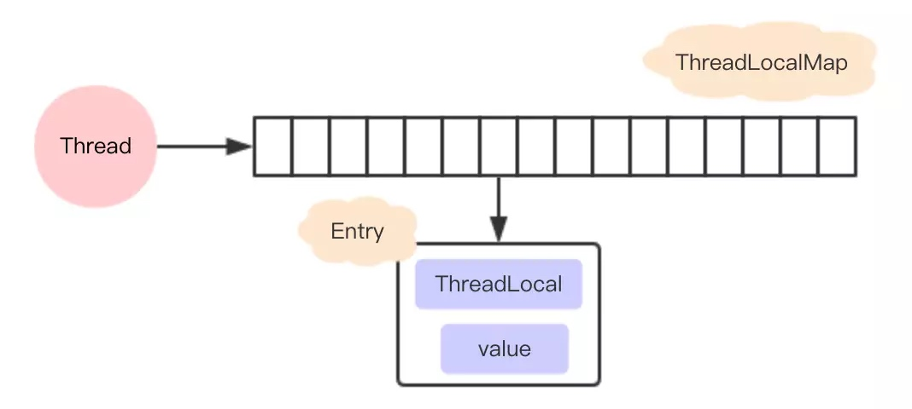

在多线程环境下，如何防止自己的变量被其它线程篡改？可以使用ThreadLocal

> ThreadLocal 的作用是提供线程内的局部变量，这种变量在线程的生命周期内起作用，减少同一个线程内多个函数或者组件之间一些公共变量的传递的复杂度。

# 实现原理

> 每个Thread 维护一个 ThreadLocalMap 映射表，这个映射表的 key 是 ThreadLocal实例本身，value 是真正需要存储的 Object。ThreadLocalMap 使用 ThreadLocal 的弱引用作为 Key ，弱引用的对象在 GC 时会被回收。和HashMap很大的区别是，Entry中没有next字段，所以就不存在链表的情况。



*ThreadLocal为什么会内存泄漏*

```
ThreadLocalMap使用ThreadLocal的弱引用作为key，如果一个ThreadLocal没有外部强引用来引用它，那么系统 GC 的时候，这个ThreadLocal势必会被回收，这样一来，ThreadLocalMap中就会出现
key为null的Entry，就没有办法访问这些key为null的Entry的value，如果当前线程再迟迟不结束的话，这些key为null的Entry的value就会一直存在一条强引用链：Thread Ref -> Thread -> ThreaLocalMap -> Entry -> value永远无法回收，造成内存泄漏。

ThreadLocal内存泄漏的根源是：由于ThreadLocalMap的生命周期跟Thread一样长，
如果没有手动删除对应key就会导致内存泄漏，而不是因为弱引用。
```

# 解决方案

> 每次使用完ThreadLocal，调用remove()方法，清除数据。
在使用线程池的情况下，没有及时清理ThreadLocal，不仅是内存泄漏的问题，更严重的是可能导致业务逻辑出现问题。所以，使用ThreadLocal就跟加锁完要解锁一样，用完就清理。

# Hash冲突

没有链表结构，那发生hash冲突了怎么办？

>
每个ThreadLocal对象都有一个hash值 threadLocalHashCode，每初始化一个ThreadLocal对象，hash值就增加一个固定的大小 0x61c88647。
> 
在插入过程中，根据ThreadLocal对象的hash值，定位到table中的位置i, 过程如下： 
```
1. 如果当前位置是空的，那么正好，就初始化一个Entry对象放在位置i上； 
2. 位置i已经有Entry对象，如果这个Entry对象的key正好是即将设置的key，那么重新设置Entry中的value； 
3. 位置i的Entry对象，和即将设置的key没关系，那么只能找下一个空位置；
```
>
这样的话，在get的时候，也会根据ThreadLocal对象的hash值，定位到table中的位置，然后判断该位置Entry对象中的key是否和get的key一致，如果不一致，就判断下一个位置
>
可以发现，set和get如果冲突严重的话，效率很低，因为ThreadLoalMap是Thread的一个属性，所以即使在自己的代码中控制了设置的元素个数，但还是不能控制其它代码的行为。


