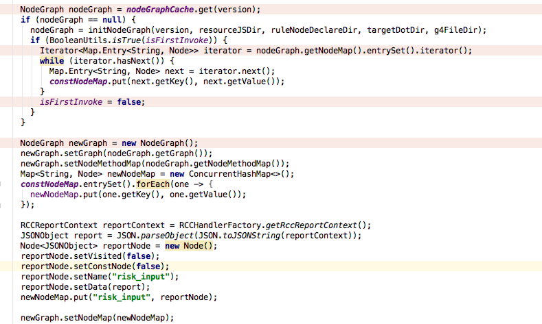
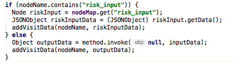
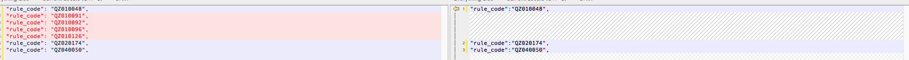

> 经过和褰哥、建军对代码进行一系列优化，现将信用盾 6 期当前问题描述如下

已解决：1、2
未解决：3

#### 问题 1 (已解决)

> 多线程调用信用盾，节点系统 NodeGraph 存在数据混乱的问题

#### 问题原因

为节约 parse 时间，节点系统将 NodeGraph 缓存，每次请求拿到的是 同一个 NodeGraph 对象，当多线程调用同时对 NodeGraph 中的 NodeMap 进行写操作，出现数据混乱问题。

#### 解决方案

NodeGraph 缓存依然保留，同时新创建一个常量 constNodeMap，每次请求 new 一个 NodeGraph，复用缓存 NodeGraph 中的 Graph、NodeMethodMap，遍历 constNodeMap 生成新对象 newNodeMap，这样每次请求，NodeGraph 内部的 NodeMap 实现线程隔离，解决了数据混乱的问题。





同时，不再每次请求时清理图
    
    //newGraph.resetData();// 清理图
关闭写 html 日志（测试组在进行单元测试时可考虑再次打开）。
   
    //GraphUtil.writeToHtml(logFileTemplateJs, logFileDataJs, newGraph);
前置向NodeGraph中添加命中黑名单规则的写入逻辑。
    
dataGatewayResponseBuilder.addBlackForNodeGraph(nodeGraph);//添加命中的黑名单到节点中

---

#### 问题 2 （已解决）

多线程调用信用盾，偶发性的报出下方的异常信息：

```
com.alibaba.fastjson.JSONException: write javaBean error, fastjson version 1.2.46, class com.rrx360.credit.graph.Node, fieldName : black_list_response, write javaBean error, fastjson version 1.2.46, class com.rrx360.credit.orm.mysql.entity.Rule_Antifraud_Blacklist, fieldName : QZ010096, Session is closed!
```

#### 解决方案

1. Node 类内部字段 data 使用泛型
2. 升级fastjson到 1.2.46
3. 优化黑名单节点向 NodeMap 中填充的value的数据类型

#### 方案解释

1. 对于 Node 类内部字段 data，原字段类型为 Object，此处使用泛型会更好。
2. fastjson 存在未知bug，升级至较新版本
3. 原黑名单向 NodeMap 中填充的 value 的数据类型为 Rule，此时执行黑名单节点的为子线程，当主线程遍历 NodeMap 获取了该 Rule 对象后写日志时，fastjson会进一步获取对象中懒加载的对象，此时子线程已经关闭，session会话结束，主线程无法拿到懒加载的数据，抛出异常。（此处应该是主要解决方案）

#### 注意事项

1. 节点系统内部禁止使用 RCCHandlerFactory 和业务对象进行数据传递
2. NodeGraph 依赖的创世节点 risk_input，该节点数据原通过 RCCHandlerFactory 注入数据，优化为：每次 drive 前，手动注入到 NodeMap中，不再调用 java 方法注入。

**经过多次测试，异常信息没有再次出现。**

-------

#### 问题 3 （待解决）

> 多线程调用信用盾，偶发性的出现命中规则不一致的情况

正常

```
"hit_count_for_level_map": {
	"高": 3,
	"中": 3,
	"低": 1
}
```

异常

```
"hit_count_for_level_map": {
	"高": 0,
	"中": 3,
	"低": 0
}
```

经过对比两次命中规则，出现数量不一致的规则为黑名单规则



#### 问题剖析

查看 mongo 日志，发现黑名单接口 response 存在较大问题，导致黑名单规则未命中。

错误 response

```
{
	"result": [
		{
			"rstCode": "0099"
		},
		{
			"rstCode": "0099"
		},
		{
			"rstCode": "0099"
		},
		{
			"rstCode": "0099"
		},
		{
			"rstCode": "0099"
		},
		{
			"rstCode": "0099"
		}
	],
	"businessNo": "112351235123",
	"rstCode": "0000",
	"serialNo": "112351235"
}
```

正常 response

```
{"result":[{"black_list":[],"rstCode":"0000"},{"black_list":[{"idNo_black":{},"dataInterfaceCode":"ds_03_special_list","mobile_black":{"sl_cell_bank_bad":"0"},"hit_key":{"mobile":"18600812883"},"mobile":"18600812883","publish_date":"2018-02-08","source_code":"020401"}],"rstCode":"0000"},{"black_list":[{"amount":"10","dataInterfaceCode":"ds_localData_blackList","overdue":"120","hit_key":{"idno":"342401199901015250"},"mobile":"18603345188","name":"测试勿动","days":"45","created_date":"2015-07-07","idno":"342401199901015250","publish_date":"2017-05-25","source_code":"010401"},{"loan_date":"2017-05-25","loan_period":"5个月","mobile":"18603345188","idno":"342401199901015250","principal_interest":"1000000","dataInterfaceCode":"ds_localData_blackList","hit_key":{"idno":"342401199901015250"},"name":"测试勿动","weihuan_penalty":"112234","yihuan_money":"4508.42","created_date":"2015-07-07","publish_date":"2013-04-19","source_code":"010301"},{"loan_date":"2017-05-25","loan_period":"5个月","mobile":"18603345188","idno":"342401199901015250","principal_interest":"100000","dataInterfaceCode":"ds_localData_blackList","hit_key":{"idno":"342401199901015250"},"name":"测试勿动","weihuan_penalty":"12234","yihuan_money":"4508.42","created_date":"2015-07-07","publish_date":"2012-04-20","source_code":"010301"},{"amount":"10","dataInterfaceCode":"ds_localData_blackList","overdue":"120","hit_key":{"idno":"342401199901015250"},"mobile":"18603345188","name":"测试中","days":"45","created_date":"2015-07-07","idno":"342401199901015250","publish_date":"2017-05-25","source_code":"010401"},{"dataInterfaceCode":"ds_localData_blackList","total_debt":"3400","hit_key":{"idno":"342401199901015250"},"mobile":"18603345188","name":"测试","daihuan":"","overdue_num":"0","idno":"342401199901015250","publish_date":"2017-10-25","source_code":"010501","max_overdue":""},{"dataInterfaceCode":"ds_localData_blackList","total_debt":"3400","hit_key":{"idno":"342401199901015250"},"mobile":"18603345188","name":"测试","daihuan":"","overdue_num":"0","idno":"342401199901015250","publish_date":"2017-09-25","source_code":"010501","max_overdue":""},{"dataInterfaceCode":"ds_localData_blackList","total_debt":"¥1440.30","total_interest":"¥1730.30","hit_key":{"idno":"342401199901015250"},"mobile":"18603345188","name":"测试","overdue_num":"","idno":"342401199901015250","publish_date":"2017-05-25","source_code":"010601","status":"逾期"},{"weihuanmoney":"30000.00","dataInterfaceCode":"ds_localData_blackList","huankuanstatus":"未还","borrowmoney":"9999.00","hit_key":{"idno":"342401199901015250"},"mobile":"18603345188","name":"张测试","idno":"342401199901015250","publish_date":"2017-05-25","source_code":"010701"},{"dataInterfaceCode":"ds_localData_blackList","overdue_days":"6-32","hit_key":{"idno":"342401199901015250"},"mobile":"18603345188","name":"戚测试","overdue_money":"","idno":"342401199901015250","publish_date":"","source_code":"040601"},{"loan_date":"2016-06-22","overdue_amount":"1000","overdue_days":"10","mobile":"18603345188","sign_date":"2016-06-22","loan_amount":"1000","idno":"342401199901015250","dataInterfaceCode":"ds_localData_blackList","hit_key":{"idno":"342401199901015250"},"name":"林测试","publish_date":"2016-08-01","source_code":"030303","overdue_periods":""},{"company_phone":"0311-86032070","home_phone":"0311-86984002","city":"石家庄","mobile":"18603345188","repayment_status":"5.0","idno":"342401199901015250","loan_type":"99.0","company_address":"桥东区栗康街3号","loan_apply_date":"2013-12-0610:50:24","marriage_status":"已婚","dataInterfaceCode":"ds_localData_blackList","home_address":"河北省石家庄市桥东区光华路房地产中介中心宿舍1-5-301","company_name":"河北省石家庄市疾病控制预防中心","confirm_date":"2013-12-0610:50:24","hit_key":{"idno":"342401199901015250"},"name":"李测试","publish_date":"2017-04-06","source_code":"040403"},{"company_phone":"0311-85127431","home_phone":"0311-85126816","mobile":"18603345188","repayment_status":"9.0","idno":"342401199901015250","loan_type":"99.0","company_address":"河北省石家庄市晋州经济循环园区","loan_apply_date":"2013-10-2418:41:50","marriage_status":"已婚","dataInterfaceCode":"ds_localData_blackList","home_address":"河北省晋州市马于镇吕家营村朝霞街31号","company_name":"石家庄盈康消毒制品有限公司","confirm_date":"2013-10-2418:41:50","hit_key":{"idno":"342401199901015250"},"name":"测试","publish_date":"2013-03-23","source_code":"040402"},{"loan_date":"2016-06-22","overdue_amount":"1000","overdue_days":"10","mobile":"18603345188","sign_date":"2016-06-22","loan_amount":"1000","idno":"342401199901015250","dataInterfaceCode":"ds_localData_blackList","hit_key":{"idno":"342401199901015250"},"name":"林测试","publish_date":"2016-08-01","source_code":"030303","overdue_periods":""},{"over_due_interest":"0","remain_principal":"15367","loan_date":"2016-02-1900:00:00","need_amt":"614","over_due_count":"1","remain_term":"27","mobile":"18603345188","loan_amt":"80000","idno":"342401199901015250","over_due_principal":"0","dataInterfaceCode":"ds_localData_blackList","over_due_date":"","over_due_terms":"0","over_due_amt":"12605","hit_key":{"idno":"342401199901015250"},"name":"蔡测试","over_due_days":"195","publish_date":"2016-11-20","source_code":"030301"},{"over_due_interest":"125","remain_principal":"4253","need_interest":"125","need_amt":"4253","remain_term":"1","mobile":"18603345188","loan_amt":"43077","need_principal":"4253","idno":"342401199901015250","remain_interest":"125","over_due_principal":"4253","dataInterfaceCode":"ds_localData_blackList","over_due_date":"2014-04-1300:00:00","over_due_terms":"35","over_due_amt":"8004","hit_key":{"idno":"342401199901015250"},"name":"刘测试","over_due_days":"205","publish_date":"2017-11-25","source_code":"030302"},{"dataInterfaceCode":"ds_localData_blackList","comments":"2015.10.30新华排查星形细胞瘤","hit_key":{"idno":"342401199901015250"},"mobile":"18603345188","name":"测试","idno":"342401199901015250","publish_date":"2015-10-30","source_code":"030101","black_reason":"欺诈客户"},{"result":"加黑","dataInterfaceCode":"ds_localData_blackList","hit_key":{"idno":"342401199901015250"},"fraud_type":"代办包装","mobile":"18603345188","name":"杜测试","purchase_date":"2015-11-13","type":"受薪贷","idno":"342401199901015250","publish_date":"2015-11-24","source_code":"030202","opinion":"代办包装:表单位物流公司单电反查对应中津信投资主营业务：天津贷款,承兑汇票贴现,天津车辆贷款,天津中小企业贷款,天津贷款公司,天津企业贷款,天津信誉贷款,天津房产抵押贷款,天津公积金贷款,天津按揭贷款,天津房屋过户"},{"loan_status":"未结清","loan_money":"30000.0","fraud_type":"工作证明虚假","mobile":"18603345188","case_type":"一般欺诈","type":"虚假单电","idno":"342401199901015250","loan_type":"物业贷","apply_date":"2015-02-04","dataInterfaceCode":"ds_localData_blackList","case_source":"回访","apply_money":"100000.0","risk_rank":"中风险","hit_key":{"idno":"342401199901015250"},"name":"牛测试","survey":"1、来案原因：回访同事怀疑客户牛浩志工作虚假；\\n2、贷款类型：客户属于物业贷，2015-2-4申请贷款，分36期，未结清；\\n3、系统匹配：系统暂时不支持；\\n4、查看审批：致电表单位，确认在职；致电本人，确认无误；\\n5、外部查询：外网搜索公司无负面信息；人行征信与客提供的信息单位名不一致，电话一致；核实客ID无误，核对工作证明，法人张迎春，无明显异常；百度查询表单电，无有效信息；\\n6、电话核实：致电114，表单位无登记；致电表单电0874-8902737，男接电确认为人行单位，客户之前为人行单位人事，但年前已经离职，表单位是承包他们公司食堂，但是两家公司；致电客手机13170700905，电话无人接听；致电其它电话，也都无有效信息；\\n综上：根据表单电描述，客单电虚假，确认欺诈。\\n建议将此客户加入黑名单","fraud_reason":"","publish_date":"2015-03-05","source_code":"030203"},{"reason":"非申请员工","dataInterfaceCode":"ds_localData_blackList","hit_key":{"idno":"342401199901015250"},"mobile":"18603345188","name":"李测试","idno":"342401199901015250","publish_date":"2015-05-27","source_code":"040101"},{"reason":"冒用数据","dataInterfaceCode":"ds_localData_blackList","hit_key":{"idno":"342401199901015250"},"mobile":"18603345188","name":"王测试","idno":"342401199901015250","publish_date":"","source_code":"040602"}],"rstCode":"0000"},{"black_list":[],"rstCode":"0000"},{"black_list":[],"rstCode":"0000"},{"black_list":[],"rstCode":"0000"}],"businessNo":"112351235123","rstCode":"0000","serialNo":"112351235"}
```


